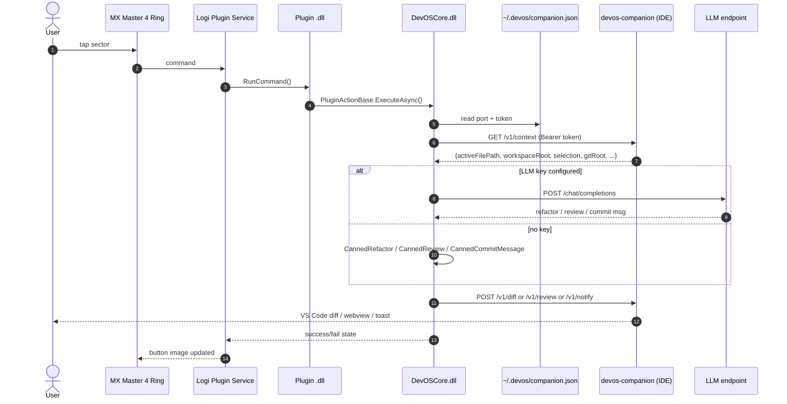

# DevOSRing - Architecture

## Why four plugins and not one?

The Loupedeck/Logi Plugin Service is happy to host a single plugin with many
actions, but the Logi Options+ UI renders an Actions Ring entry per plugin, and
during prototyping the consolidated plugin did not render correctly. Keeping
four `.lplug4` artefacts preserves the visual one-action-per-sector model and
lets each ship/version independently.

To avoid the boilerplate explosion, every plugin links a single shared assembly
(`DevOSCore.dll`). The plugin code itself is then ~30 lines of `Plugin` class +
one `Action` class.

## Request flow per button press

## Concurrency model

- `PluginActionBase.RunCommand` immediately returns to the Logi dispatcher and
  spawns the real work on a `Task.Run` thread. The dispatcher is never blocked.
- A `CancellationTokenSource` is armed with the action's `RunTimeout` (default
  5 min, Tests overrides to 10 min, Deploy to 5 min).
- A single `Interlocked.Exchange` flag debounces repeated presses while a run is
  in-flight: subsequent presses log and return immediately.
- Per-state image updates (`Idle`/`Busy`/`Success`/`Error`) call
  `ActionImageChanged()` so the button reflects progress on the device.

## Security

- The companion server only binds `127.0.0.1` (loopback). It never accepts a
  connection from anywhere off the host.
- Each activation generates a fresh 32-byte hex bearer token. The token is
  written to `~/.devos/companion.json` with mode `0600`; the .NET client reads
  it from there on first request and caches it.
- LLM API keys are stored via `Plugin.SetPluginSetting(..., isSecure: true)` so
  the host encrypts them at rest.
- The companion does not allow scripts in its review webview
  (`enableScripts: false`) and applies a strict CSP.

## Fallback behaviour matrix

| Action       | Real (LLM key set)                     | Fallback (no key)                                |
|--------------|----------------------------------------|--------------------------------------------------|
| AI Refactor  | LLM rewrite of active file/selection   | Roslyn pass for C#: collapse nested `if`s, simplify `if x return true else false`; generic whitespace tidy for other langs |
| Run Tests    | (LLM not used)                          | (Same as real - test runners are always invoked)|
| AI Review    | LLM-generated Markdown review of diff   | Diff-aware Markdown summary with heuristic risk scan (TODO/console.log/hardcoded secret patterns, blast radius) |
| Deploy       | LLM-generated Conventional Commit msg   | Deterministic message: `<type>(<scope>): update <N> files`, type inferred from file kinds, scope = longest common directory |

## Extending with a new action

1. Add an `Action` class deriving from `PluginActionBase` inside the plugin's
   `Actions/` folder. Override `ExecuteAsync(CancellationToken)` and return
   `ActionOutcome.Ok(...)` or `.Fail(...)`.
2. Use `CompanionClient` to talk to the IDE; use `LlmClient`/`LlmSettings` for
   AI; use `ProcessRunner`/`GitOps` for shell + git operations.
3. Rebuild the plugin (`dotnet build -c Release` in the plugin folder). The
   `LinkAndReload` MSBuild target drops a fresh `.link` file in
   `~/Library/Application Support/Logi/LogiPluginService/Plugins/` and fires
   `open loupedeck:plugin/<short>/reload`, so the host picks it up without a
   service restart.

## Cross-platform support

| Component                | macOS | Windows | Linux       |
|--------------------------|-------|---------|-------------|
| DevOSCore.dll            | yes   | yes     | n/a (no Logi service) |
| Plugin .dlls             | yes   | yes     | n/a         |
| Companion extension      | yes   | yes     | yes         |
| `git` / `dotnet test`    | yes   | yes     | yes         |
| `TerminalLauncher` (opt) | `open -a Terminal` | `cmd /c start` | `xdg-open` |

Windows code paths are written but primary developer machine is macOS; Windows
artefacts need a Windows build host to exercise the `Logi Options+` flow end-to-end.
